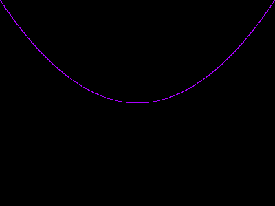

# Crosslywere's Portable Pixmap Library
This my simple implementation of a simple PPM image generator.
Add breakpoints after the `img.CompileImage()` line in the "test.cpp" to be able to view the current PPM output to the "Image.ppm" file.

# Combination of all features

# Latest uses of functions

Currently trying to implement Splines and Bezier Curves.